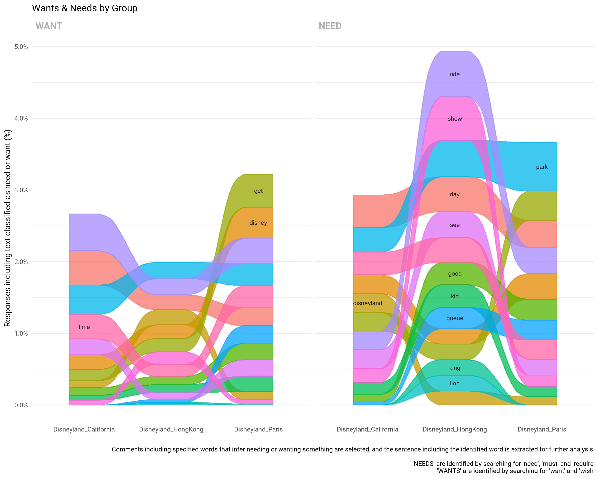

Needs & Wants
================

## Extracting “needs” and “wants” from text

For each group, any sentence containing the specified words are selected
for further analysis.

Specified words with a negating word prior to it are removed.

Words in the final plot have been lemmatized to group together related
words.

### Specified words

#### Needs

-   “need”
-   “must”
-   “require”

#### Wants

-   “want”
-   “wish”
